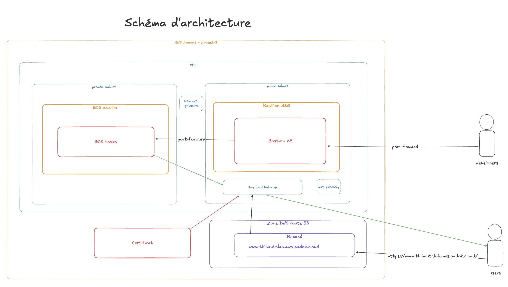

# List of all commands I runned

## Create state bucket and apply terraform layers

```zsh
tfswitch
cd bootstrap
tf init
tf apply
cd ../network
tf init
tf apply
cd ../ecs-cluster
# Update harcoded values in main.tf (vpc and public_subnet ids)
tf init
tf apply
cd ../ecs-debug-policy
tf init
tf apply
cd ../ecs-service
# Update harcoded values in main.tf (bastion_sg, debug_policy_arn, vpc and private_subnet ids, lb_arn et target_group_arn)
tf init
tf apply
cd ../route53
# Update harcoded values in main.tf (alb dns endpoint)
tf init
tf apply
```

## Architecture deployed

<p align="center"></p>
