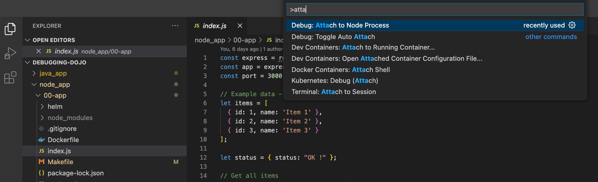
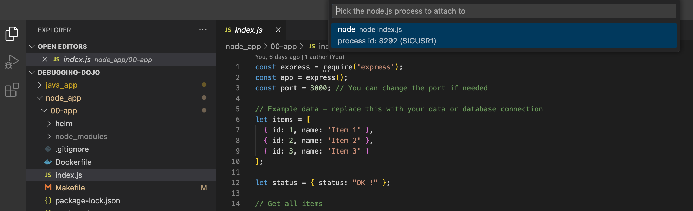

# Local node debugging

## Prerequisites

- install node

```bash
brew install node@18
```

- install npm

```bash
brew install npm
```

- vscode

## Start the node server

- Use makefile to show usefull commands:

```bash
make install
```

- Start the node local server

```bash
make start
```

- Now, you can test the server access using the http://localhost:3000 url.

## Use the local debugger (VScode)

- Use the short-cut `Ctrl + shit + P` or `Cmd + shit + P`
- Enter `Attach to Node Process`

- Select your node server PID

- Now, the debugger is activate, try to add breakpoint to get the real `flag` value

<details>
<summary>💡 Hint 1</summary>
You can add a breakpoint in the index.js file
</details>
<details>
<summary>💡 Hint 2</summary>
The line 30 is a good candidate.
</details>
