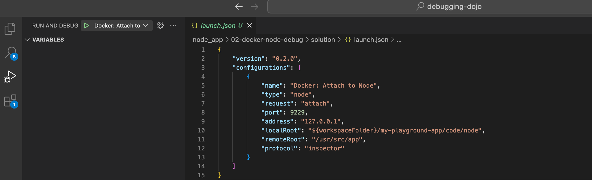

# Docker node debugging

## Prerequisites

- Docker : [Download](https://www.docker.com/products/docker-desktop/)

- vscode

## Start the node server

- Build your own docker image using the provided Dockerfile
⚠️ The build args depends of your processor [build arm image]( https://www.padok.fr/en/blog/docker-arm-architectures)
- Start docker daemon, if you haven't already done
- Start container
<details>
<summary>💡 Hint 1</summary>
You need to expose the 3000 port if you want to access to the service from your computer localhost.
</details>
<details>
<summary>💡 Hint 2</summary>
You need to expose the 9229 port if you want to be able to use the node socket for docker debugging
</details>

**Now, you can test the server access using the http://localhost:3000 url.**

## Connect VScode debugger to docker

- If you try to attach the node process to your debugger, no process are detected
- Open a terminal in the docker container
- Get the PID of the node process :
Use `ps aux` command and the output should be like :
```bash
USER       PID %CPU %MEM    VSZ   RSS TTY      STAT START   TIME COMMAND
root         1  0.0  0.4 587208 39152 ?        Ssl  09:03   0:00 node --inspect-port=0.0.0.0:9229 index.js
root        20  0.0  0.0   2388   752 pts/0    Ss   09:10   0:00 /bin/sh
root        29  0.0  0.0   7640  2700 pts/0    R+   09:11   0:00 ps aux
```
- Send a signal to node process to activate the debug mode :
```bash
kill -USR1 1
```
- Now, your node process had opened a socket on `9229` port to communicate with your debugger
Your container logs now contain :
```bash
Debugger listening on ws://0.0.0.0:9229/09bd5555-1e07-4a25-aff4-748145ecf100
For help, see: https://nodejs.org/en/docs/inspector
```
- Again, if you try to attach the node process to your debugger, no process are detected
- You need to update your debugger configuration to accept node socket that are not hosted on `localhost`
- Create a `lauch.json` file in a  `.vscode` folder
- Create a new configuration and specify the `address` and the `port`.
<details>
<summary>💡 Hint 1</summary>
"port": 9229,
"address": "127.0.0.1",
</details>
<details>
<summary>💡 Hint 2</summary>
    "configurations": [
        {
            "name": "Docker: Attach to Node",
            "type": "node",
            "request": "attach",
            "port": 9229,
            "address": "127.0.0.1",
            "localRoot": "${workspaceFolder}/node_app/00-app",
            "remoteRoot": "/usr/src/app",
            "protocol": "inspector"
        }
    ]
</details>
<summary>💡 Hint 3</summary>
Be careful to the `localRoot` path, it will depend of your context
</details>

- For any modification in the `.vscode` config folder you need to reload VScode. Use `Cmd + shit + p` then use `Developer: Reload Window`
- Click on the green play button in the debug tab

- Now find the second flag, by stopping the process at the good time to get the second flag

<details>
<summary>💡 Hint 1</summary>
Use `/flags/:id` route
</details>
<details>
<summary>💡 Hint 2</summary>
The line 49 is a good candidate.
</details>
